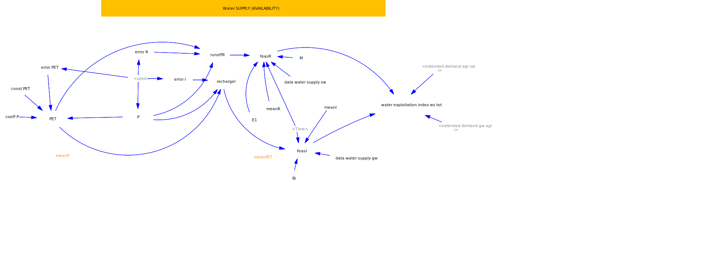
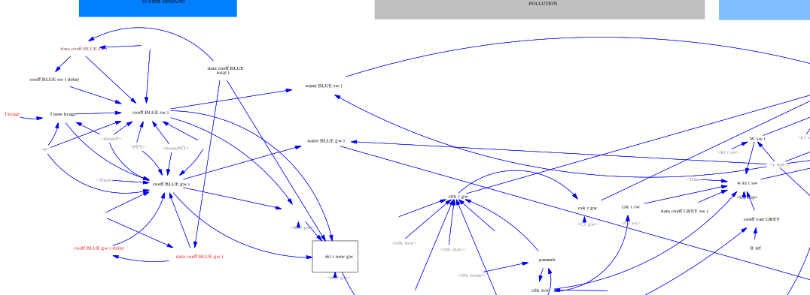

# MUST4Water Dynamic Water Stress Model (Vensim)
## 🧭 Model Diagram

Below is the high-level structure of the Vensim model.

This repository contains the Vensim model developed for the MUST4Water project (Deliverable D1), titled `M4W_model_28062024.mdl`.

## 📘 Overview

The model simulates hydrological and economic interactions in the Italian water system under climate and demand variability. It integrates both physical and institutional constraints into a system dynamics framework to evaluate sustainable water use strategies.
## 💧 MUST4Water System Diagrams

### 🔹 Water Supply Model

### 🔹 Water Demand Model

### Key Features

- **Hydrological Components**: Precipitation (P), Evapotranspiration (E), Runoff (R), Groundwater Recharge (I)
- **Economic Coupling**: Sector-specific water extraction, restitution, and dilution coefficients
- **Dynamic Water Accounting**: Blue and green water use, adjusted for climate and demand
- **Policy Constraints**: Ecological flow minimums, maximum concessions
- **Sustainability Metric**: Extended Water Exploitation Index (EWEI)

## 🗂 Files

- `M4W_model_28062024.mdl` – Vensim model file
- `LICENSE` – MIT License
- `README.md` – This file

## 🛠 Requirements

- [Vensim PLE or DSS](https://vensim.com/download/) (recommended version 8.0 or higher)

## 🚀 How to Run the Model

1. Open `M4W_model_28062024.mdl` in Vensim
2. Configure simulation time settings (based on model defaults)
3. Run the simulation
4. Examine outputs including:
   - Water extractions per sector
   - Hydrological variability impacts
   - Extended Water Exploitation Index (EWEI)

## 📈 Model Diagram

Below is the high-level structure of the Vensim model.

## 📚 Reference

For model structure, data sources, and methodology, refer to:

> MUST4Water Deliverable D1: Data Collection and Analysis Report (September 2024)

## 📝 License

This project is licensed under the MIT License. See the `LICENSE` file for details.

---

